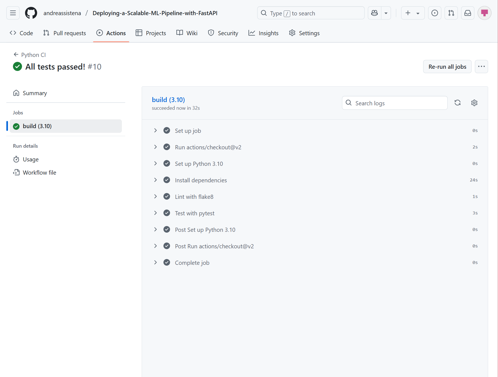
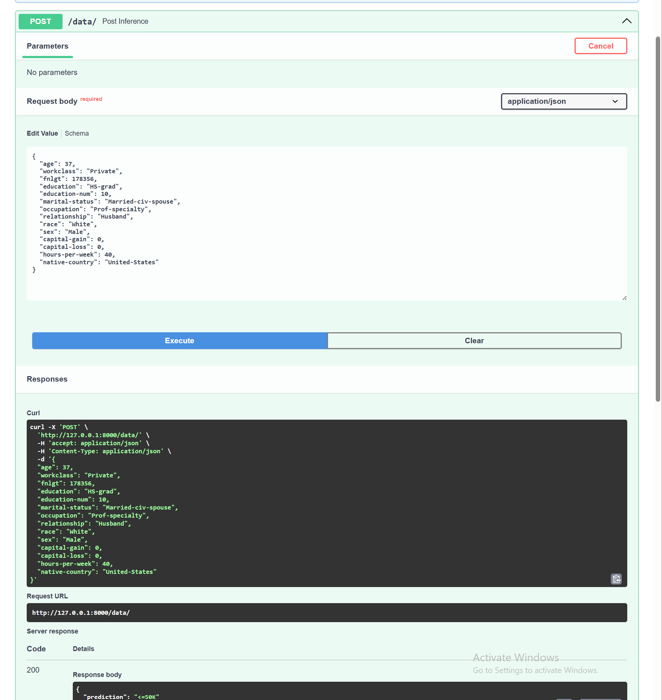

Deploying a Scalable Machine Learning Pipeline with FastAPI
This project demonstrates how to build, train, and deploy a machine learning pipeline using FastAPI. The model predicts whether an individual's income is above or below $50K based on census data.

GitHub Repository
Link to Public GitHub Repo:
https://github.com/andreassistena/Deploying-a-Scalable-ML-Pipeline-with-FastAPI

Note: Ensure this link is also pasted in the "Submission Details" box when submitting the project.

Project Structure
css
Copy
Edit
Deploying-a-Scalable-ML-Pipeline-with-FastAPI/
├── model/
│   ├── model.pkl
│   ├── encoder.pkl
│   └── lb.pkl
├── ml/
│   ├── model.py
│   └── data.py
├── main.py
├── train_model.py
├── test_ml.py
├── requirements.txt
├── environment.yml
└── README.md
Setup Instructions
 Using Conda
bash
Copy
Edit
conda env create -f environment.yml
conda activate fastapi

Model Training
Train the machine learning model on cleaned census data:

Copy
Edit
python train_model.py
This script:

Cleans and processes the data

Trains a RandomForestClassifier

Saves the model, encoder, and label binarizer to the model/ directory

Running the FastAPI App
Start the FastAPI server locally:

css
Copy
Edit
uvicorn main:app --reload
Then visit:

Documentation: http://127.0.0.1:8000/docs

Root Endpoint: http://127.0.0.1:8000/

Running Unit Tests
To run tests:

nginx
Copy
Edit
pytest test_ml.py
Included tests:

The root endpoint returns the welcome message

The model performs inference on valid data

The API returns a 422 error when required fields are missing

All tests must pass before submission. A screenshot of test results has been taken for reviewer reference.

Model Evaluation
Includes:

Performance reporting on data slices for categorical features

Inference API endpoint

Evaluation metrics: precision, recall, and F1-score

Model Card
If required, the model card is included as model_card.md. It describes model design, assumptions, performance, limitations, and ethical considerations.

API Endpoints
GET /
Returns a welcome message.

POST /data/
Performs inference on input data.

Example request:

json
Copy
Edit
{
  "age": 37,
  "workclass": "Private",
  "fnlgt": 178356,
  "education": "HS-grad",
  "education-num": 10,
  "marital-status": "Married-civ-spouse",
  "occupation": "Prof-specialty",
  "relationship": "Husband",
  "race": "White",
  "sex": "Male",
  "capital-gain": 0,
  "capital-loss": 0,
  "hours-per-week": 40,
  "native-country": "United States"
}
Example response:

json
Copy
Edit
{
  "prediction": "<50K"
}
Submission Checklist
 Public GitHub repository

 GitHub link included in README and submission

 Trained model and artifacts saved to model/

 Functional FastAPI app with GET and POST endpoints

 Unit tests for at least 3 functions

 All tests pass using pytest

## Continuous Integration (CI)

## POST Inference Example

